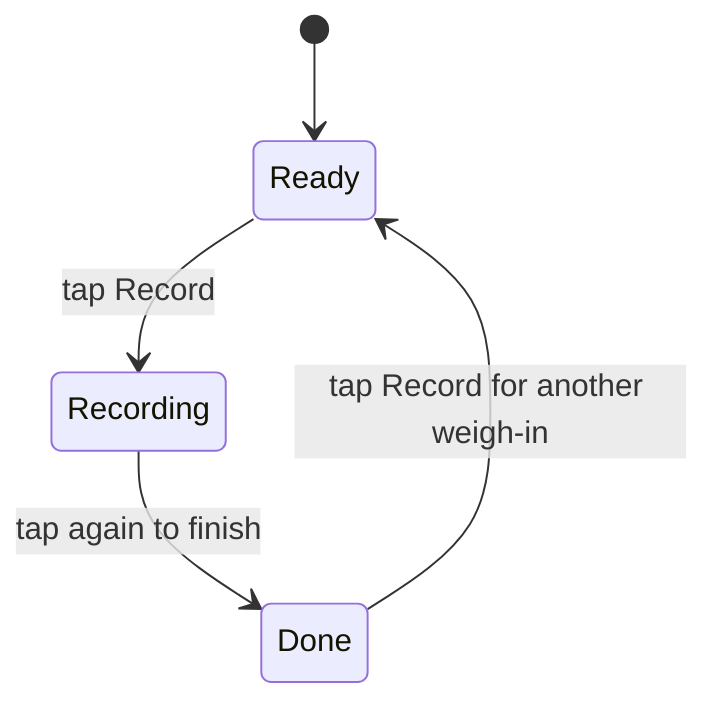

# Snoopy

Snoopy is its own Android app. It is separate from Nucleus. A non-technical friend uses it to capture one weigh-in from a smart scale (Dr Trust, Cult.fit, and others).

This document is the plan. It does not add the app.

## Stack

A small native Android app: one Kotlin module, built with Gradle.

The screen scans Bluetooth Low Energy, lists the packets from one weigh-in, and shares a file. Android's Bluetooth APIs do that directly. Expo Go cannot scan Bluetooth Low Energy, so an Expo app would still generate a native project and carry a React Native runtime this screen does not use. Nucleus needs that runtime. Snoopy does not share Nucleus's app code.

The release rules below follow Nucleus (`Soldier0x0/Nucleus`, `.github/workflows/android-apk.yml` and `.github/scripts/`).

## Screens

One screen, three states. The friend never leaves it.



- **Ready.** One instruction and one button: "Stand on the scale, then tap Record."
- **Recording.** The live monitor for this weigh-in. It shows the name the scale advertised, the connection state in plain words (Looking, Connecting, Connected, Failed), and each message as it arrives. One weigh-in is one session. A second tap finishes it. A quiet scale does not end the session by itself.
- **Done.** The advertised name, every weight-like number from the session, and a share action for that session's one file. If no weight-like number was found, the screen says none was found.

The app asks for Bluetooth (and nearby-devices on current Android). It has no internet permission. Sessions stay in app-private storage. `applicationId` is `com.snoopy.app`.

## What a session records

The app scans, connects, and saves the messages from that weigh-in. It subscribes to the notifications the scale exposes and records every packet in the session, including the short writes that turn notifications on. It sends no scale-specific commands.

Each message line has the time, the direction, the hex, and a readable text line when the bytes look like text.

- Direction `in` is scale to phone. Direction `out` is phone to scale.
- Hex is the raw bytes.
- Text is filled only when those bytes are readable text. Otherwise the text field is empty.
- A weight-like number is a readable number in a human weight range (about 20–250 kg, or about 44–550 lb) taken from that text. The app does not decode binary fields and does not parse body-fat fields. Capture and display the log only.

Bluetooth off, or no scale nearby, stays a plain failure on the monitor. If the scale refuses because its companion app is connected, the screen says: "Close the companion app and try again." If it still only wakes for its own app, the screen says: "This model cannot be recorded here." and that attempt stops. Those screens do not mention developer options, HCI snoop, or a computer. The app does not read Android's Bluetooth HCI snoop log. A normal app cannot.

## Log file

Share one UTF-8 text file for that session. The file holds the raw bytes and the readable view together. Sharing uses the Android share sheet. Nothing is uploaded.

```
snoopy 1
started: 2026-10-03T19:51:02.100Z
ended: 2026-10-03T19:51:18.400Z
advertised_name: Dr Trust
weight_like: 72.4

time	direction	hex	text
2026-10-03T19:51:03.010Z	in	57 65 69 67 68 74 3a 20 37 32 2e 34	Weight: 72.4
2026-10-03T19:51:03.020Z	out	01 00
```

`weight_like` repeats the numbers shown on the Done screen, separated by commas. When none were found, the value is `none`.

## Release

The first version ships an installable APK on GitHub Releases. Source alone is not the release.

Versions stay under 1.0, starting at v0.1. One pull request publishes one version. That version may be v0.1, a later v0.2, or one sub-version such as v0.1.1. It is still only one of them.

`CHANGELOG.md` has one section per published version, newest first. The section says what the version is for and what changed, in short points. Add that section in the pull request that ships the version. Do not pre-seed the next version. This plan does not add a changelog section.

Publish rules, matching Nucleus:

- A release is published only when a green APK exists and the changelog has those points for that one version.
- A missing section does not fail the build and does not publish.
- An empty section fails. A section with no points fails.
- A note that only says the app is the same as the previous one is not published, and that check fails. A republish is allowed only when the points name the file, say that nothing in the app changed, and say why the release exists.
- The workflow fails if the changelog has a section for any other version that has not already shipped.

`.github/workflows/android-apk.yml` runs on `ubuntu-latest`.

- A pull request compiles one arm64-v8a release APK and uploads it as an Actions artifact named `snoopy-apk-` plus the git tree id. A newer push on that branch cancels the run already going.
- A change that is only docs, `CHANGELOG.md`, `README.md`, or other markdown does not compile.
- A push to `main` publishes the green pull-request APK for that same git tree. The main job has no compile step. If that artifact is missing, the job fails.
- The Release asset is `snoopy-v0.1.apk` for v0.1, and `snoopy-<tag>.apk` after that. It is attached to the GitHub Release for that tag. The tag points at the commit that was built. The Release notes are the changelog section, plus one line: install this file over the current app, and uninstalling wipes the logs on the phone.

Signing uses one key for every APK, including the pull-request build. The key is created once and stored as repository secrets: `ANDROID_KEYSTORE_BASE64`, `ANDROID_KEYSTORE_PASSWORD`, `ANDROID_KEY_ALIAS`, `ANDROID_KEY_PASSWORD`. The `versionCode` is the pull-request run number, so a newer file can replace the installed app. If any secret is missing, the job fails. It does not sign with a machine debug key.

`README.md` documents the install: replacing the app wipes nothing when the signing key matches. Uninstalling wipes the on-phone logs.

## Where the app will live

```
app/                              Kotlin app and Gradle project
.github/workflows/android-apk.yml pull-request build and main publish
.github/scripts/                  version, changelog checks, compile-or-reuse
CHANGELOG.md                      created in the v0.1 pull request
README.md                         install and wipe note
docs/plan.md                      this plan
```

## Done

v0.1 is done when all of these are true:

- GitHub Releases has `snoopy-v0.1.apk`, built by the green pull request for that git tree. The merge did not compile it again.
- Installing that APK over an existing Snoopy install does not require uninstall, and the on-phone logs are still there. Uninstalling removes them.
- The friend can stand on a scale, tap Record, and watch the device name, the connection state, and each message (time, direction, hex, and text when the bytes look like text).
- After the weigh-in, the screen shows the advertised name and any weight-like number, and Share sends one file with the raw bytes and the readable view.
- When the companion app is holding the scale, the screen says "Close the companion app and try again." When the scale still only wakes for its own app, the screen says "This model cannot be recorded here." and stops.
- The phone made no upload. The app did not read an HCI snoop log. The log has no body-fat fields.

## Assumptions

- A second tap ends the session. The plan does not add a silence timer.
- Weight-like numbers come only from readable text. A scale that sends weight only as binary shows `none` in v0.1.
- The four signing secrets exist before the first app pull request. Until they do, no APK is signed.
- The friend installs from GitHub Releases on an arm64 phone.
